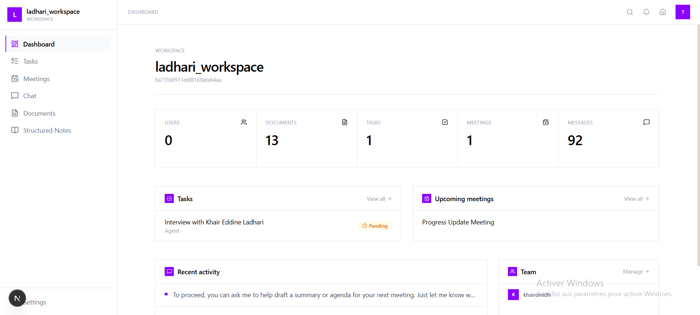
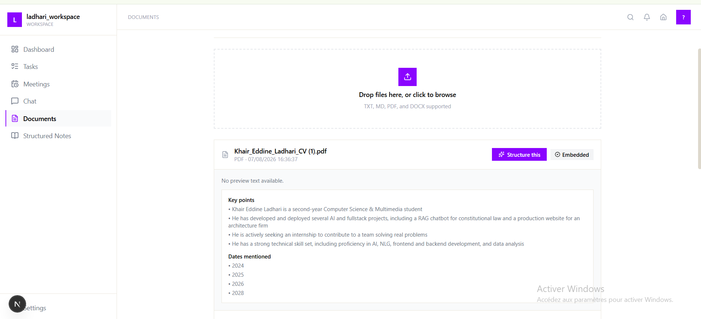
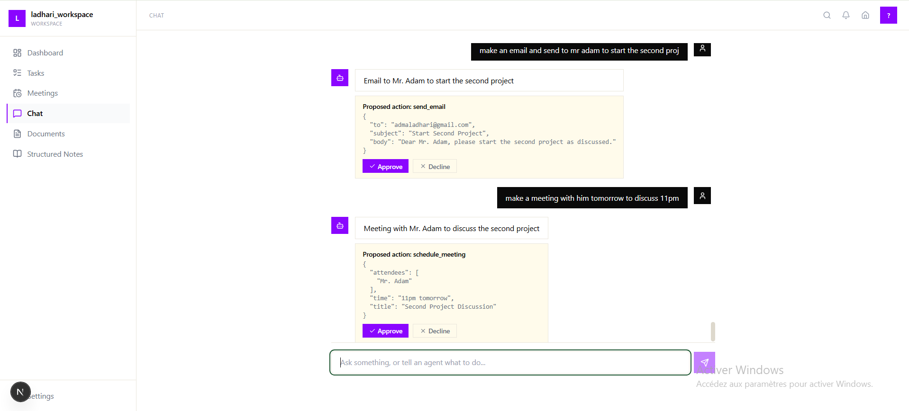
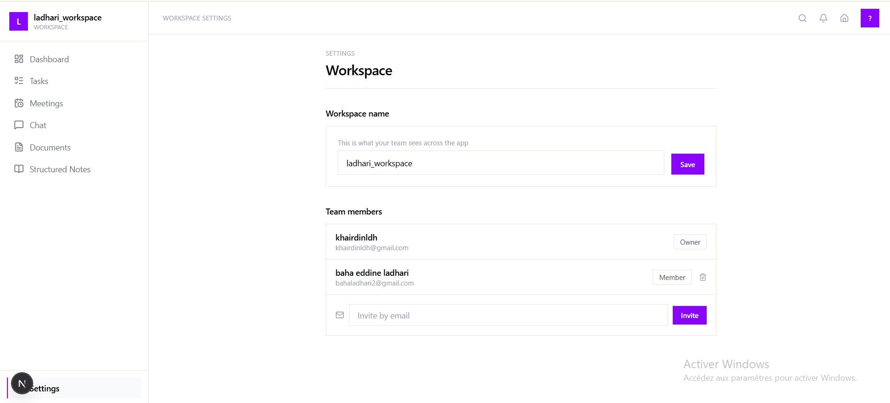
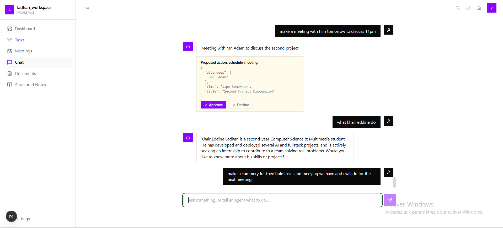

# AgentDesk

AgentDesk is a workspace assistant that combines a multi-agent LLM backend with a document-aware knowledge base. It lets a team upload documents, chat with an AI assistant that routes requests to specialized agents, get meetings/tasks summarized automatically, and approve or decline AI-proposed actions (emails, tasks, meetings) before anything is actually executed.

## Overview

At its core, AgentDesk is built around a **classify-then-dispatch orchestrator**: every user message is routed to one of five specialist agents based on intent, rather than relying on a single general-purpose chatbot. Actions that would have a real-world effect (sending an email, creating a task, scheduling a meeting) are never executed directly by the AI — they're always proposed, logged, and require explicit human approval before an executor runs them.

## Architecture

AgentDesk is split into three services:

- **`back_web`** — Node.js/Express API. Owns auth, workspace/user/task/meeting data (MongoDB), the approval/execution flow, and is the only service the frontend talks to directly.
- **`back_ai`** — Python/FastAPI agent service. Owns the LLM orchestration layer (LangGraph/LangChain agents, Groq inference, Pinecone retrieval, document ingestion). Only ever called server-to-server by `back_web`, never exposed to the browser.
- **Frontend** — Next.js (App Router) application with a token-based Tailwind design system.

```
Browser
  │
  ▼
back_web (Express)  ──JWT auth, Mongo, approval flow, executors
  │  server-to-server only
  ▼
back_ai (FastAPI)   ──Orchestrator, agent classification, LangGraph agents
  │
  ▼
Groq (LLM) · Pinecone (vector search)
```

## Agent System

Every incoming message is classified into one of five intents by an LLM router (`classify_intent`, using a low-temperature Groq call with a deterministic short-circuit for greetings/small talk), then dispatched to the matching specialist agent:

| Intent | Agent | Purpose |
|---|---|---|
| `chat` | Chat agent | Casual conversation, greetings, vague follow-ups — kept separate so these don't get misrouted into a document-search dead end |
| `rag` | RAG agent | Answers questions from the workspace's own stored documents via Pinecone retrieval |
| `structuring` | Structuring agent | Converts pasted raw notes/transcripts into structured output (key points, action items, mentioned dates) |
| `action` | Action agent | Drafts a proposed task, email, or meeting for human approval — never executes anything itself |
| `summarize` | Summarize agent | Builds a brief for each upcoming meeting by combining meeting data, matched open tasks, and related workspace documents |

Agents are implemented as LangGraph `create_react_agent` tool-using loops (Groq `llama-3.3-70b-versatile`) with a shared retry wrapper for transient tool-call failures. Meeting/task data for the summarize agent is passed in per-request via a factory closure rather than exposed as LLM-fillable parameters, since it comes from the trusted backend payload, not the user.

The orchestrator supports a "sticky routing" override: if the previous assistant turn was the action agent asking a clarifying question, the next user message stays routed to `action` instead of being reclassified — so a bare follow-up reply (e.g. just an email address) doesn't get misclassified as `chat` and orphan an in-progress action.

## Approve-Before-Execute Flow

No agent can directly send an email, create a task, or schedule a meeting. The flow is:

1. An agent (typically `action` or `summarize`) calls `propose_action`, which only drafts — it never executes.
2. `back_web` writes an `ActionLog` record (`status: needs_review`) and a corresponding `ChatMessage` with `requiresApproval: true`, surfaced to the user as an approval card.
3. On approval, `back_web`'s `EXECUTORS` map runs the actual side effect:
   - `create_task` — writes a `Task` document
   - `send_email` — sends via SendGrid
   - `schedule_meeting` — writes a `Meeting` document
4. Executors always derive `workspaceId`/`userId` from the authenticated request context, never from the request body — so an approval can never write into a workspace the caller doesn't belong to.
5. Decline updates the `ActionLog`/`ChatMessage` without running anything.

## Document Ingestion & RAG

- Files are uploaded through `back_web`, which extracts raw text and forwards it to `back_ai`'s `/ingest` endpoint.
- `back_ai` owns chunking, embedding, and upserting into Pinecone (namespaced per workspace) — `back_web` no longer does any of that directly.
- The `rag` and `summarize` agents both query the same Pinecone index via a shared `retrieve` tool to ground answers in the workspace's own documents.

## Tech Stack

**Backend (`back_web`)**
- Node.js, Express
- MongoDB / Mongoose
- JWT authentication + Passport.js, with tenant-scoping middleware enforcing workspace membership on every request
- Cloudinary (file/image storage) and a multer-based upload middleware
- SendGrid (transactional email)
- Security: `helmet`, `express-rate-limit` (general + stricter auth-route limiting), locked-down CORS to a single frontend origin, 10kb JSON body limit, environment-aware error handler (stack traces hidden in production)

**Agent service (`back_ai`)**
- Python, FastAPI, Pydantic
- LangChain / LangGraph (`create_react_agent`, ReAct tool-calling loops)
- Groq (`llama-3.3-70b-versatile` for agents/classification)
- Pinecone (vector storage and retrieval)
- LangSmith (agent evaluation dataset + experiment runs, `eval/langsmith_dataset.py`, `run_experiment.py`)
- Guardrails module (`guardrails/review_gate.py`) for pre-execution review checks

**Frontend**
- Next.js (App Router), React
- Tailwind CSS with a custom design token system (`bg`, `surface`, `ink`, `muted`, `border`, `accent`, `danger`, plus `rounded-card` / `rounded-control` / `rounded-pill` / `shadow-soft` utilities)
- `lucide-react` icons, `axios`

## Project Structure

```
AgentDesk/
├── backend/
│   ├── back_ai/                        # FastAPI agent service
│   │   ├── agents/
│   │   │   ├── action_agent.py
│   │   │   ├── chat_agent.py
│   │   │   ├── rag_agent.py
│   │   │   ├── structuring_agent.py
│   │   │   └── summery_agent.py
│   │   ├── eval/
│   │   │   └── langsmith_dataset.py    # LangSmith eval dataset for agent QA
│   │   ├── guardrails/
│   │   │   └── review_gate.py          # pre-execution safety/review checks
│   │   ├── tools/
│   │   │   ├── agent_lang_graph_tools/
│   │   │   │   ├── __init__.py
│   │   │   │   ├── propose_action.py
│   │   │   │   ├── query_workspace_docs.py
│   │   │   │   └── summary_tool.py
│   │   │   ├── retrieval_tool.py
│   │   │   └── task_tool.py
│   │   ├── .env
│   │   ├── ingestion_tool.py
│   │   ├── main.py                     # /agents/run, /ingest, /health
│   │   ├── orchestrator.py             # classify_intent, run_orchestrator
│   │   ├── push_dataset.py
│   │   ├── requirements.txt
│   │   ├── run_experiment.py
│   │   ├── runtime.txt
│   │   └── test_classify.py
│   │
│   └── back_web/                       # Express API
│       ├── config/
│       │   ├── cloudinary.js
│       │   └── db.js
│       ├── controllers/
│       │   ├── agent.controller.js     # callAgent, approveAction, declineAction, executors
│       │   ├── auth.controller.js
│       │   ├── dashboard.controller.js
│       │   ├── document.controller.js
│       │   ├── meeting.controller.js
│       │   ├── Note.controller.js
│       │   ├── task.controller.js
│       │   └── workspace.controller.js
│       ├── middleware/
│       │   ├── auth.js
│       │   ├── passport.js
│       │   ├── tenantScope.js          # workspace-scoping guard
│       │   └── upload.js
│       ├── models/
│       │   ├── ActionLog.js
│       │   ├── ChatMessage.js
│       │   ├── Document.js
│       │   ├── Meeting.js
│       │   ├── StructuredNote.js
│       │   ├── Task.js
│       │   ├── User.js
│       │   └── Workspace.js
│       ├── routes/
│       │   ├── actions.js
│       │   ├── agent.routes.js
│       │   ├── auth.routes.js
│       │   ├── dashboard.routes.js
│       │   ├── document.routes.js
│       │   ├── meetings.js
│       │   ├── meetings_del.js
│       │   ├── note.routes.js
│       │   ├── tasks.js
│       │   ├── tasks_del.js
│       │   └── workspace.routes.js
│       ├── uploads/
│       ├── .env
│       ├── package.json
│       └── server.js
│
└── frontend/my-app/                    # Next.js (App Router)
    ├── public/
    ├── src/
    │   ├── app/
    │   │   ├── (auth)/
    │   │   ├── (protected)/
    │   │   │   ├── chat/
    │   │   │   ├── Createworkspacepage/
    │   │   │   │   └── page.jsx
    │   │   │   ├── dashboard/
    │   │   │   │   └── page.jsx
    │   │   │   ├── documents/
    │   │   │   │   └── page.jsx
    │   │   │   ├── meetings/
    │   │   │   ├── settings/
    │   │   │   ├── structured-notes/
    │   │   │   ├── tasks/
    │   │   │   └── layout.jsx
    │   │   ├── globals.css
    │   │   ├── layout.jsx
    │   │   ├── loading.jsx
    │   │   ├── not-found.jsx
    │   │   └── page.jsx
    │   └── components/
    │       ├── AppShell.jsx
    │       ├── GlobalContext.jsx
    │       ├── Sidebar.jsx
    │       └── TopBar.jsx
    ├── .env
    ├── next.config.mjs
    ├── package.json
    └── postcss.config.mjs
```

## Environment Variables

**`back_web`**
```
MONGODB_URI=
CLIENT_URL=              # frontend origin, for CORS
AGENT_SERVICE_URL=       # back_ai base URL, e.g. http://localhost:8000
SENDGRID_API_KEY=
SENDGRID_FROM_EMAIL=
PORT=5001
NODE_ENV=development|production
```

**`back_ai`**
```
GROQ_API_KEY=
BACKEND_ORIGIN=          # back_web origin, for CORS (server-to-server only)
```

**Frontend**
```
NEXT_PUBLIC_API_URL=     # back_web base URL
```

## API Endpoints (`back_web`)

| Method | Route | Description |
|---|---|---|
| `POST` | `/api/auth/*` | Auth routes (rate-limited to 10 req/15min per IP) |
| `POST` | `/api/workspaces/agents/run` | Send a query to the agent orchestrator |
| `POST` | `/api/workspaces/documents` | Upload a document for ingestion |
| `POST` | `/api/workspaces/actions/approve` | Approve a proposed action |
| `POST` | `/api/workspaces/actions/decline` | Decline a proposed action |
| `GET` | `/api/dashboard/stats` | Workspace stats + activity/task/meeting previews |
| `GET` | `/health` | Health check |

## Design System

The frontend uses a small set of semantic Tailwind tokens rather than literal colors, so the whole UI can be re-themed from one place:

- **Colors**: `bg`, `surface`, `ink`, `muted`, `border`, `accent`, `accent-hover`, `danger`
- **Shape**: `rounded-card` (containers), `rounded-control` (inputs), `rounded-pill` (buttons/badges/avatars)
- **Depth**: `shadow-soft`
- **Brand accent**: purple, `#8A05FF`

## Notable Engineering Decisions

- **Server-to-server isolation**: `back_ai` only accepts requests from `back_web`'s origin — the browser never talks to the agent service directly, keeping LLM/vector-store credentials off the client-reachable surface.
- **Trusted-payload data separation**: meeting/task context for the summarize agent, and workspace/user IDs for action executors, always come from the authenticated backend request — never from LLM output or client-supplied body fields — so the model can inform what happens but never dictate who it happens to or under what identity.
- **Free-text scheduling fields**: `Meeting.time` and `Task.dueDate` are intentionally stored as free-text strings (e.g. "Friday 2pm") rather than parsed `Date` objects, since the agent proposes natural-language values from user conversation rather than validated dates — downstream consumers treat them as display text, not sortable/filterable timestamps.
- **Graceful degradation on LLM/tool failures**: agent calls are wrapped with retry logic for transient tool-call failures, and errors are classified (rate limits vs. other failures) so the user gets an honest, specific message instead of a generic failure or a raw 500.

## Screenshots

<!--
Add screenshots by dropping image files into a /screenshots (or /docs/images)
folder at the repo root and pointing each line below at the file, e.g.:

-->

| Dashboard | Documents |
|---|---|
|  |  |

| Chat / Agent routing | Create workspace |
|---|---|
|  |  |

| Approval flow |
|---|
|  |

## Author

Built by Khair Eddine Ladhari.